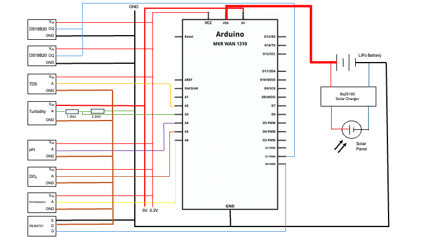

:Author: eva cunningham
:Email:
:Date: 30/11/2024
:Revision: version#
:License: Public Domain

= Project: Water Sensor Hub

This project is a water sensor hub based on Arduino that measures:

- Air Temperature
- Water Temerature
- Water pH
- Water Total Dissolved Solids
- Water Tubridity
- Dissolved Oxygen in Water

== Step 1: Installation
Please describe the steps to install this project.

For example:

1. Open this file
2. Edit as you like
3. Release to the World!

== Step 2: Assemble the circuit

Assemble the circuit following the diagram layout.png attached to the sketch

== Step 3: Load the code

Upload the code contained in this sketch on to your board

=== Folder structure

....
 water_sensor                  => Arduino sketch folder
  ├── Rubys_Things_dec01a.ino  => main Arduino file
  ├── thingProperties.h        => Key cloud variables (automatically generated)
  ├── layout.png               => Image of the layout
  └── ReadMe.adoc              => this file
....

=== Layout

=== License
This project is released under a GNU GENERAL PUBLIC LICENSE.

=== Contributing
To contribute to this project please contact via GitHub

=== Help
This document is written in the _AsciiDoc_ format, a markup language to describe documents. 
If you need help you can search the http://www.methods.co.nz/asciidoc[AsciiDoc homepage]
or consult the http://powerman.name/doc/asciidoc[AsciiDoc cheatsheet]
